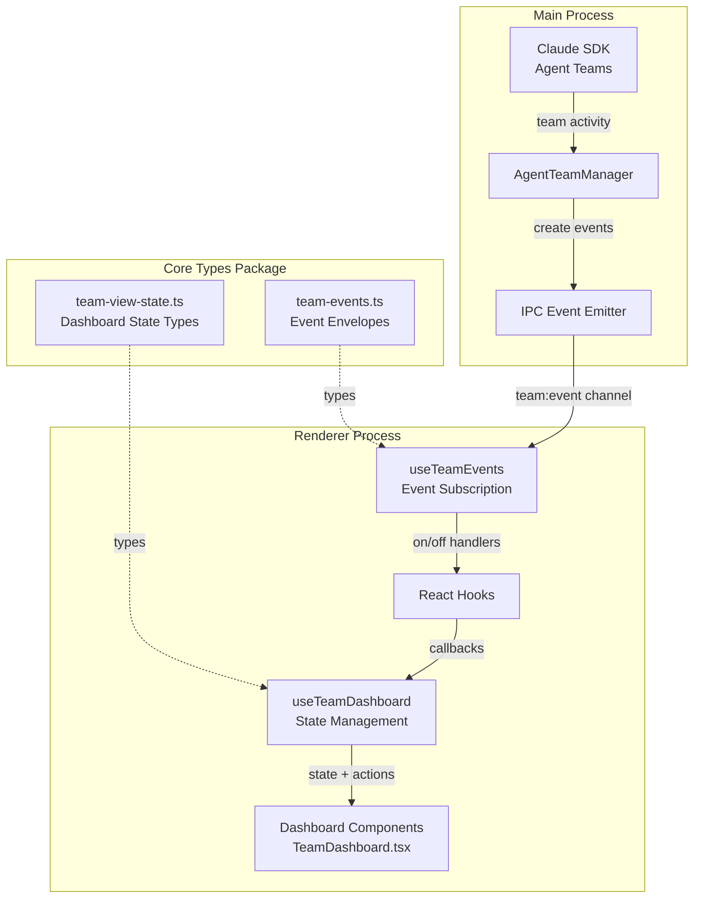
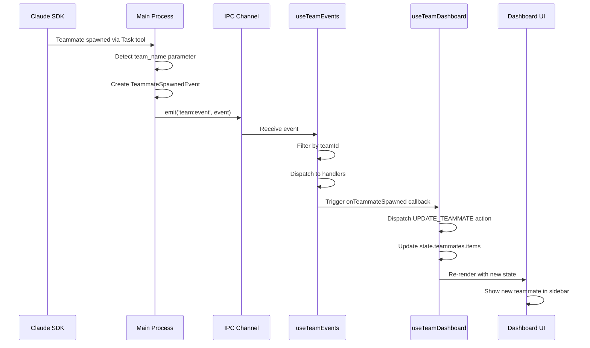
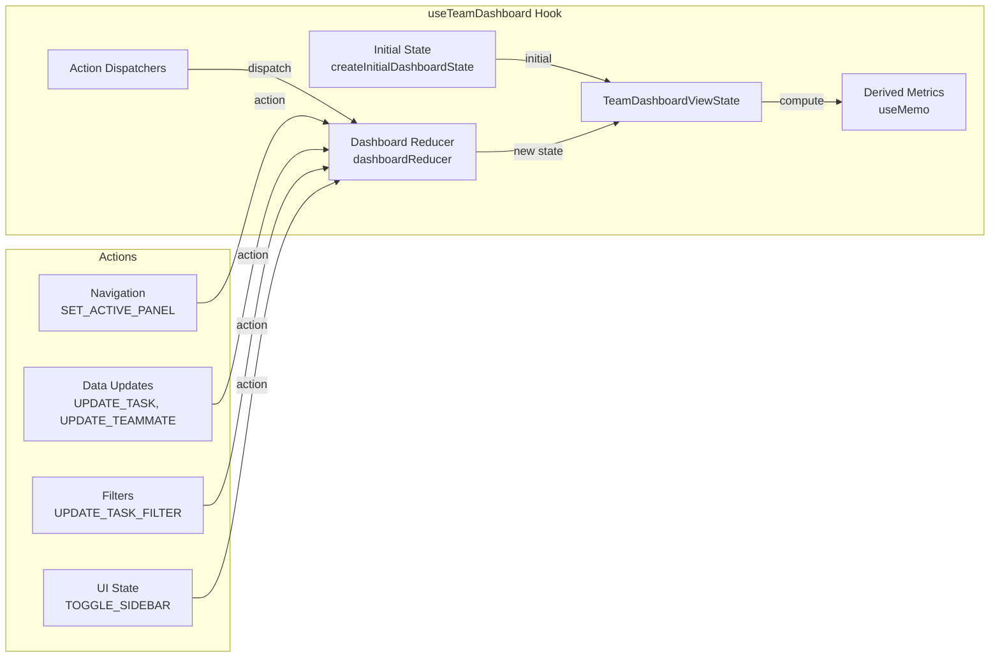
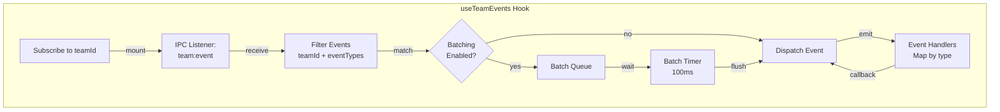
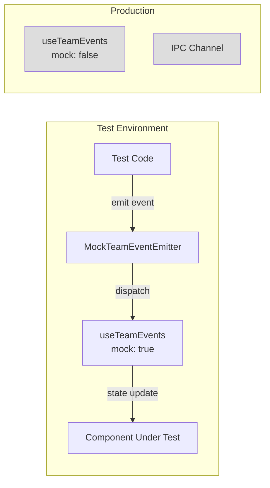
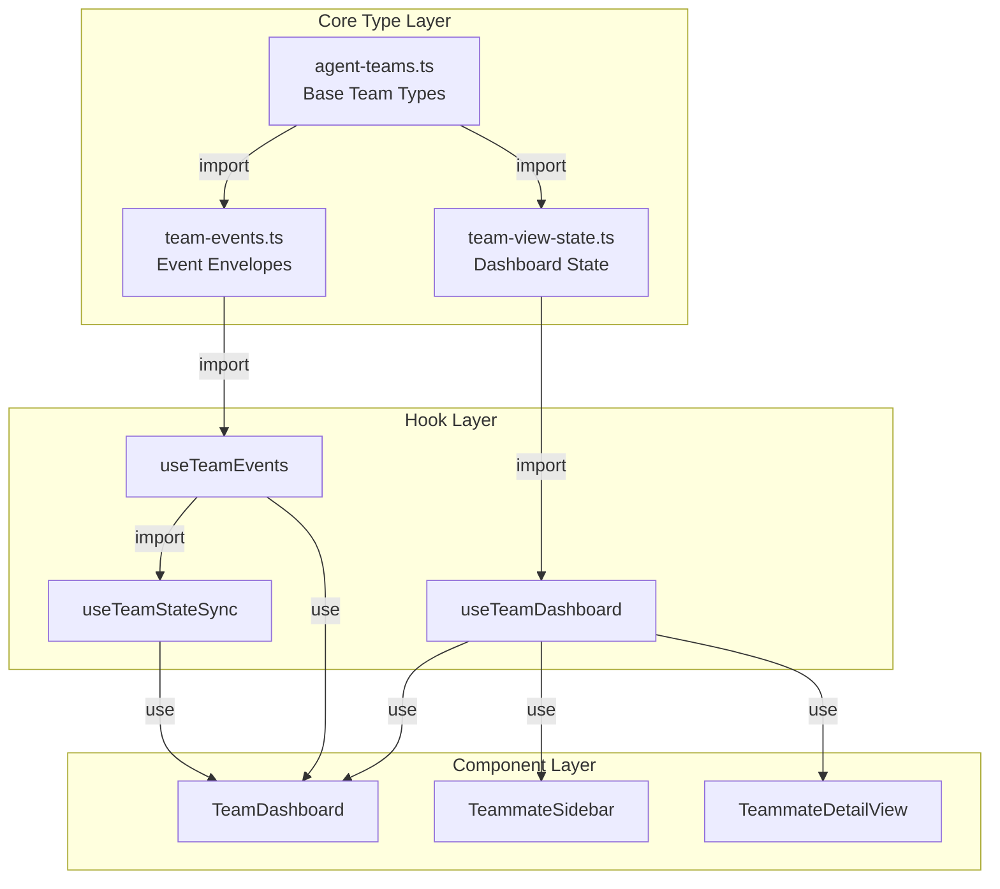
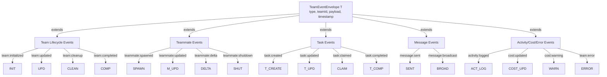
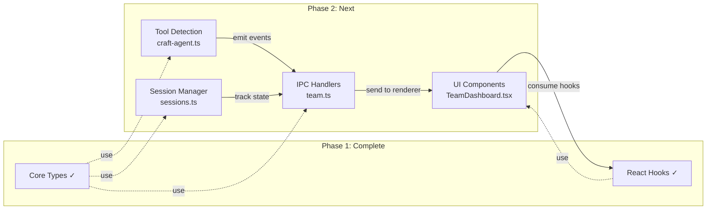
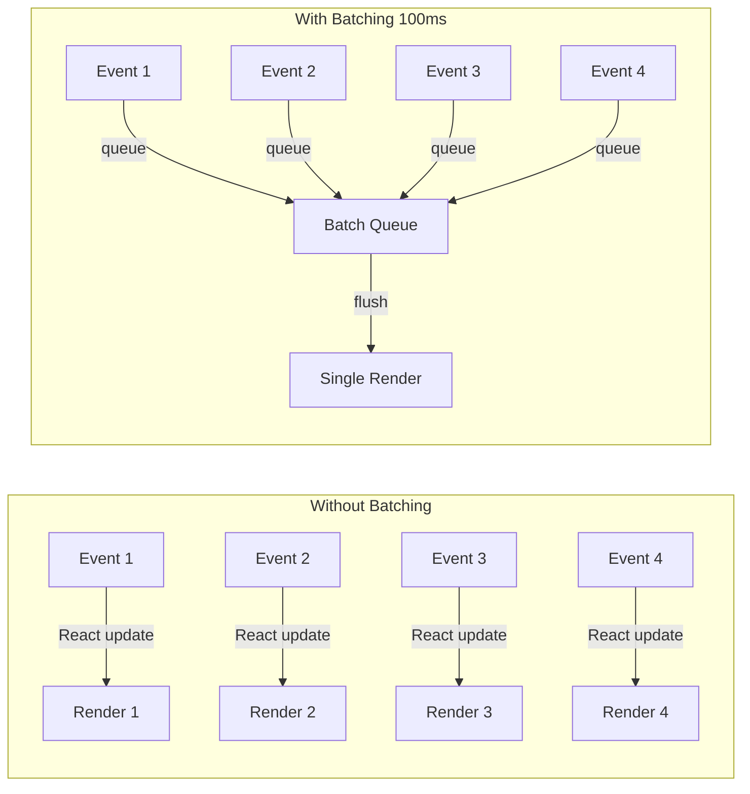

# Phase 1 Architecture

## System Overview



## Data Flow: Event Emission to UI Update



## State Management Architecture



## Event Subscription Flow



## Mock Testing Architecture



## Type Dependency Graph



## Dashboard State Structure

```mermaid
graph TB
    ROOT[TeamDashboardViewState]

    ROOT -->|team| TEAM[AgentTeam]
    ROOT -->|activePanel| PANEL[DashboardPanel]
    ROOT -->|selectedTeammate| SEL[AgentTeammate]
    ROOT -->|tasks| TASKS[TaskState]
    ROOT -->|teammates| MATES[TeammateState]
    ROOT -->|activity| ACT[ActivityState]
    ROOT -->|messages| MSG[MessageState]
    ROOT -->|costs| COST[CostState]
    ROOT -->|ui| UI[UIState]
    ROOT -->|realtime| RT[RealtimeState]

    TASKS -->|items| TASK_ARR[TeamTask[]]
    TASKS -->|filter| FILTER[TaskFilter]
    TASKS -->|expanded| EXP[Set string]

    MATES -->|items| MATE_ARR[AgentTeammate[]]
    MATES -->|sortBy| SORT[SortOrder]

    ACT -->|events| EVENT_ARR[TeamActivityEvent[]]
    ACT -->|filter| ACT_FILTER[ActivityFilter]
    ACT -->|autoScroll| SCROLL[boolean]

    MSG -->|items| MSG_ARR[TeammateMessage[]]
    MSG -->|threads| THREADS[Map]

    COST -->|summary| SUMMARY[TeamCostSummary]
    COST -->|expanded| COST_EXP[boolean]

    UI -->|sidebarCollapsed| SB[boolean]
    UI -->|detailPanelVisible| DP[boolean]
    UI -->|loading| LOAD[boolean]
    UI -->|error| ERR[string]

    RT -->|connected| CONN[boolean]
    RT -->|lastUpdate| LAST[timestamp]
    RT -->|pendingUpdates| PEND[number]
```

## Event Type Hierarchy



## Integration Points for Phase 2



## Real-Time Update Pipeline

```mermaid
graph LR
    subgraph "Event Source"
        SDK_TOOL[SDK Tool Call:<br/>Task with team_name]
        FILE_WATCH[File Watcher:<br/>~/.claude/teams/]
        AGENT_MGR[AgentTeamManager]
    end

    subgraph "Event Creation"
        FACTORY[createTeamEvent]
        ENVELOPE[TeamEventEnvelope]
    end

    subgraph "Transport"
        IPC_SEND[mainWindow.send<br/>team:event]
        IPC_RECV[ipcRenderer.on<br/>team:event]
    end

    subgraph "Consumption"
        HOOK_SUB[useTeamEvents<br/>subscription]
        HOOK_BATCH[Event Batching]
        HANDLER[Event Handler]
        STATE_UPDATE[State Dispatch]
    end

    SDK_TOOL -->|detect| AGENT_MGR
    FILE_WATCH -->|detect| AGENT_MGR
    AGENT_MGR -->|create| FACTORY
    FACTORY -->|envelope| ENVELOPE
    ENVELOPE -->|emit| IPC_SEND
    IPC_SEND -->|channel| IPC_RECV
    IPC_RECV -->|subscribe| HOOK_SUB
    HOOK_SUB -->|queue| HOOK_BATCH
    HOOK_BATCH -->|dispatch| HANDLER
    HANDLER -->|trigger| STATE_UPDATE
```



## Performance Characteristics

### Event Batching Benefits



**Result:** ~75% reduction in render cycles for burst activity

### Memory Usage Pattern

- **Dashboard State:** ~50KB base + ~5KB per teammate + ~1KB per task
- **Event Queue:** ~2KB per event × batch size (typically 10-50 events)
- **Message Threads:** ~3KB per conversation thread

**Example:** Team of 5 teammates, 20 tasks, 100 activity events = ~200KB total state
