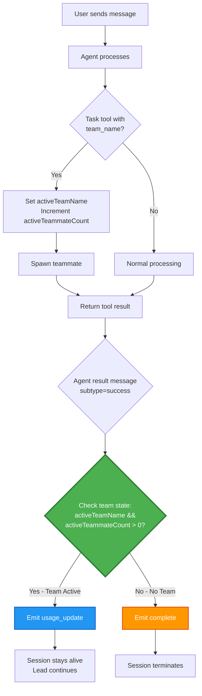
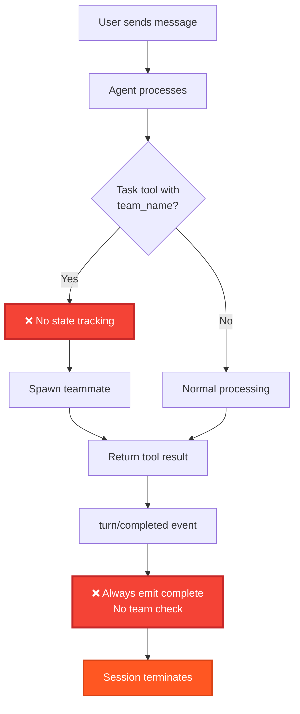
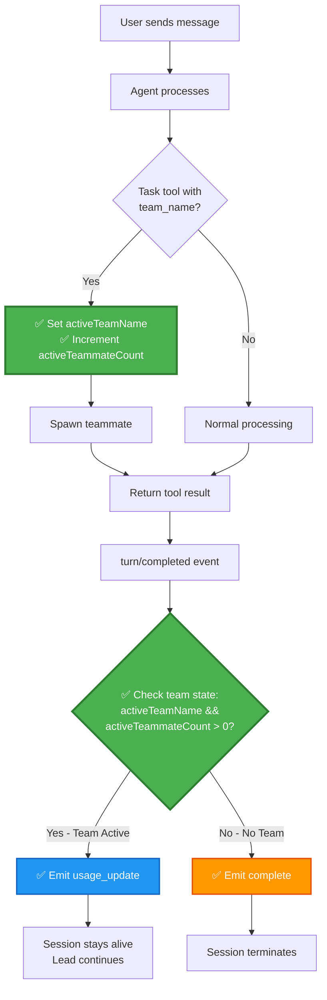
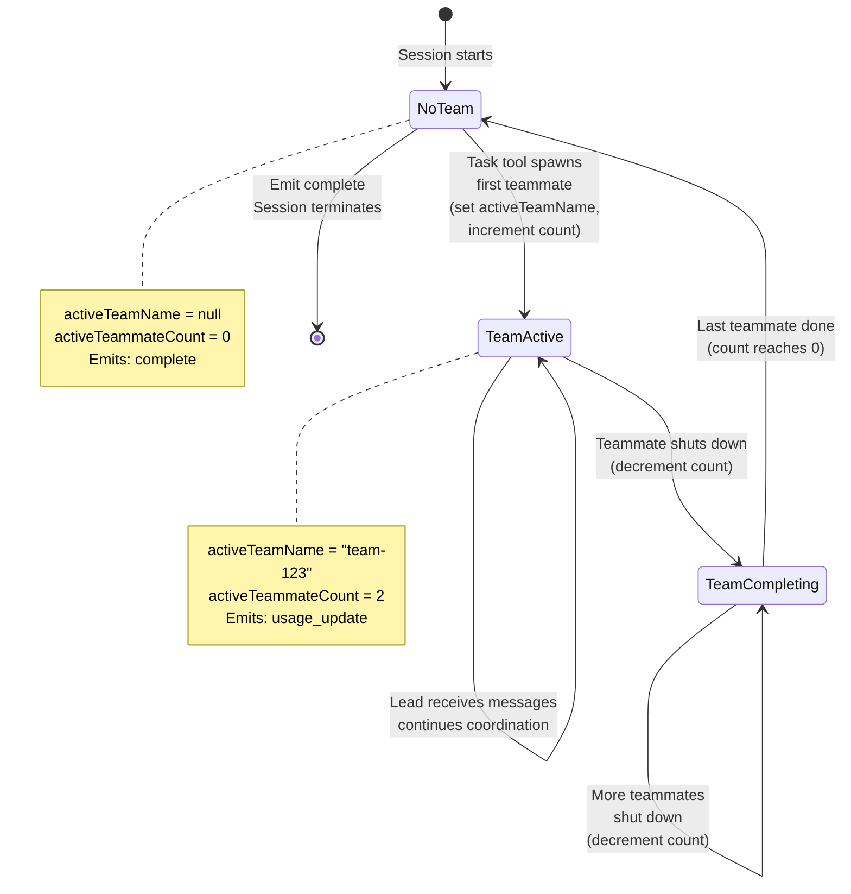
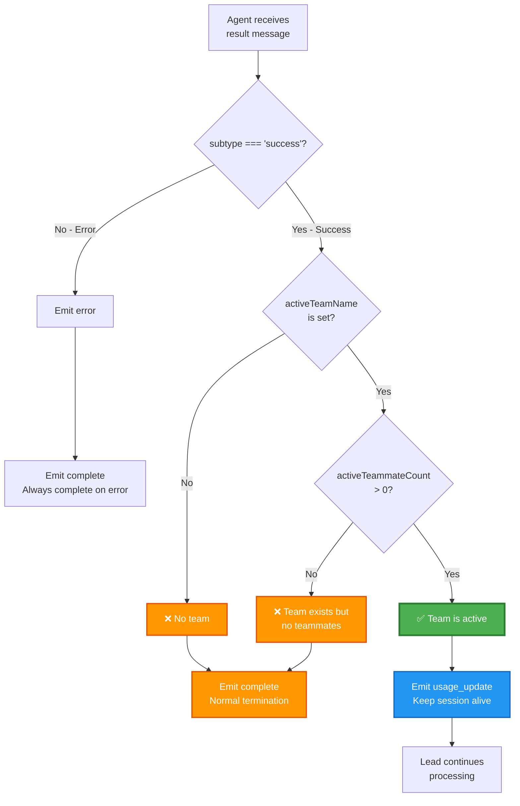
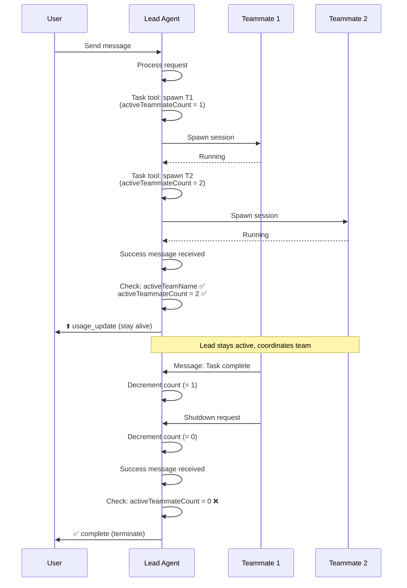
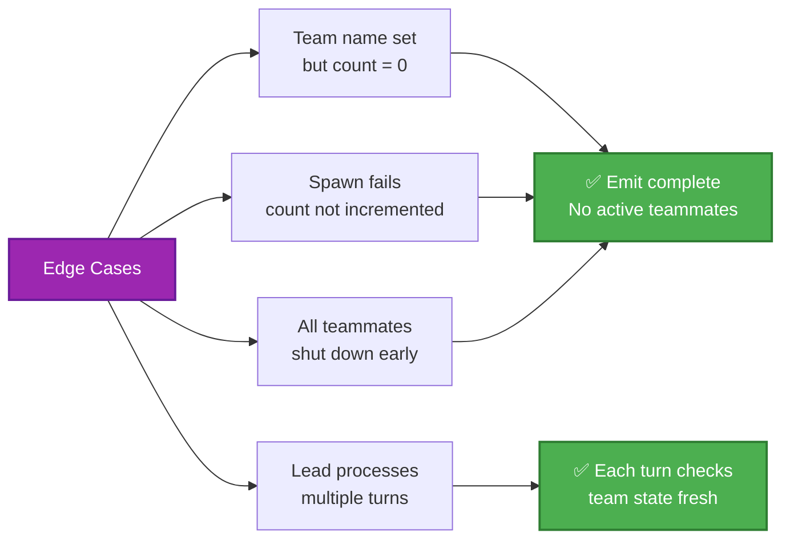

# Agent Completion Flow Diagram

Visual representation of how completion gating works for agent teams (REQ-001, REQ-003).

## ClaudeAgent: Current (Correct) Flow

## CodexAgent: Current (Missing Gating) Flow

## CodexAgent: Proposed (Fixed) Flow

## State Lifecycle

## Completion Decision Tree

## Multi-Agent Sequence

## Edge Cases

## Implementation Locations

```mermaid
graph TD
    subgraph ClaudeAgent [ClaudeAgent ✅]
        CA1[Lines 403-406:<br/>State properties]
        CA2[Lines 920-927:<br/>Set state on spawn]
        CA3[Lines 2573-2589:<br/>Gate completion]
        CA1 --> CA2
        CA2 --> CA3
    end

    subgraph CodexAgent [CodexAgent ❌→✅]
        CO1[Lines 167-266:<br/>❌ No state properties<br/>✅ Add after line 211]
        CO2[Lines 1157-1192:<br/>❌ No state tracking<br/>✅ Add after line 1162]
        CO3[Lines 427-441:<br/>❌ No gating<br/>✅ Add team check]
        CO4[Lines 1933-1936:<br/>❌ No gating<br/>✅ Add team check]
        CO1 --> CO2
        CO2 --> CO3
        CO3 --> CO4
    end

    style CA1 fill:#4CAF50,stroke:#2E7D32,stroke-width:2px,color:#fff
    style CA2 fill:#4CAF50,stroke:#2E7D32,stroke-width:2px,color:#fff
    style CA3 fill:#4CAF50,stroke:#2E7D32,stroke-width:2px,color:#fff
    style CO1 fill:#2196F3,stroke:#1565C0,stroke-width:2px,color:#fff
    style CO2 fill:#2196F3,stroke:#1565C0,stroke-width:2px,color:#fff
    style CO3 fill:#2196F3,stroke:#1565C0,stroke-width:2px,color:#fff
    style CO4 fill:#2196F3,stroke:#1565C0,stroke-width:2px,color:#fff
```

---

**Requirements Traceability**:
- REQ-001: Lead agent does not emit `complete` when team is active → Gating condition
- REQ-003: Lead agent emits `complete` normally when no team → Else branch

**Key Insight**: The gating condition `activeTeamName && activeTeammateCount > 0` is the critical check that differentiates team-aware completion from normal completion.
