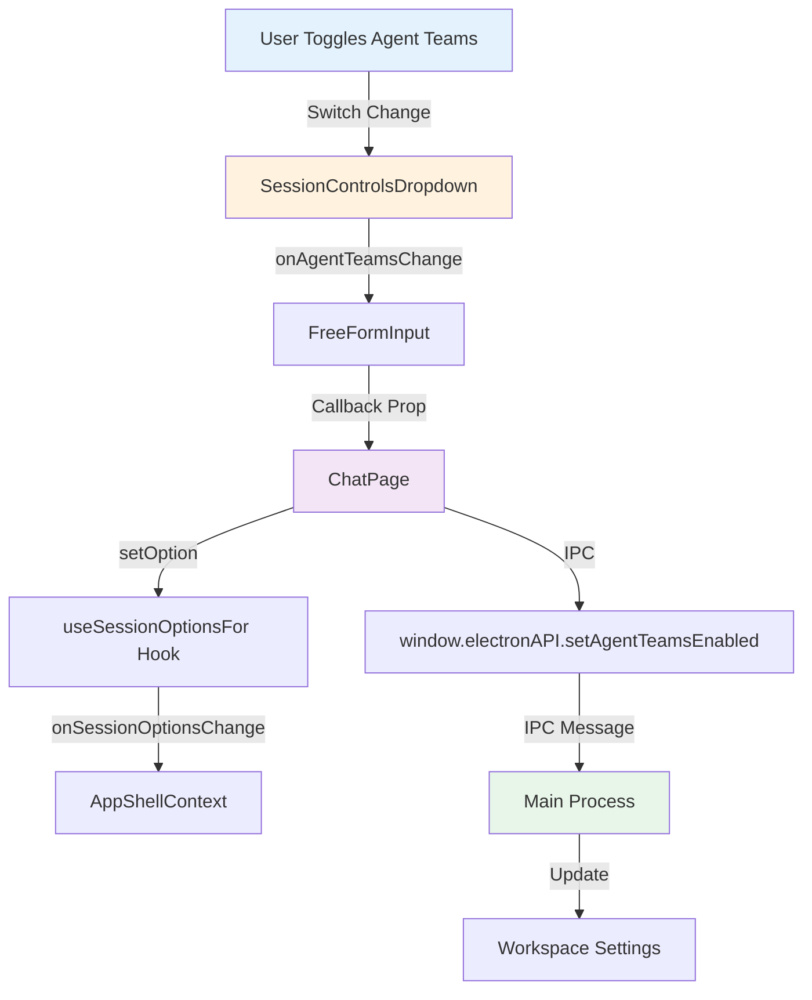

# Chat Input Component - Comprehensive Exploration Report

**Date:** February 13, 2026
**Objective:** Locate and document the chat input component where users type messages, including model selector, toolbar, and state management.

---

## Executive Summary

The chat input system consists of **two main components**:
1. **`FreeFormInput.tsx`** - The main input component (1,940 lines) containing textarea, model selector, toolbar buttons
2. **`InputContainer.tsx`** - Wrapper that handles animations and switches between free-form and structured input modes

**Key Location:** `apps/electron/src/renderer/components/app-shell/input/`

---

## 1. Component Architecture

### 1.1 Main Input Component
**File:** `apps/electron/src/renderer/components/app-shell/input/FreeFormInput.tsx`

**Key Features:**
- Auto-growing textarea with rich text input
- File attachments via button or drag-drop
- Inline slash commands menu
- Inline @ mentions (skills, sources, files)
- Inline # labels and workflow states
- Model/connection selector dropdown
- Submit/stop button
- Source selector
- Working directory badge
- Attach files button

**Component Structure (lines 1320-1940):**
```tsx
return (
  <form onSubmit={handleSubmit}>
    <div className="overflow-hidden transition-all">
      {/* Inline autocomplete menus */}
      <InlineSlashCommand />
      <InlineMentionMenu />
      <InlineLabelMenu />

      {/* Attachment preview */}
      <AttachmentPreview />

      {/* Rich text input */}
      <RichTextInput />

      {/* Bottom Row: Controls */}
      <div className="flex items-center gap-1 px-2 py-2">
        {/* Left side: Context badges */}
        <div className="flex items-center gap-1 min-w-32 shrink">
          {/* 1. Attach Files Badge */}
          <FreeFormInputContextBadge icon={<Paperclip />} />

          {/* 2. Source Selector Badge */}
          {onSourcesChange && <FreeFormInputContextBadge icon={<DatabaseZap />} />}

          {/* 3. Working Directory Selector Badge */}
          {onWorkingDirectoryChange && <WorkingDirectoryBadge />}
        </div>

        {/* Spacer */}
        <div className="flex-1" />

        {/* Right side: Model + Send */}
        <div className="flex items-center shrink-0">
          {/* 5. Model/Connection Selector */}
          <DropdownMenu>
            <button>{currentModelDisplayName}</button>
            {/* Hierarchical connection → model selector */}
          </DropdownMenu>

          {/* 5.5 Context Usage Warning Badge */}
          {showWarning && <button>{usagePercent}%</button>}

          {/* 6. Send/Stop Button */}
          {isProcessing ? (
            <Button onClick={handleStop}>
              <Square />
            </Button>
          ) : (
            <Button type="submit">
              <ArrowUp />
            </Button>
          )}
        </div>
      </div>
    </div>
  </form>
)
```

### 1.2 Input Container
**File:** `apps/electron/src/renderer/components/app-shell/input/InputContainer.tsx`

**Responsibilities:**
- Animates height transitions between free-form and structured modes
- Renders `FreeFormInput` for normal chat
- Renders `StructuredInput` for permission/credential requests
- Applies Ultrathink glow effect overlay
- Crossfades content during mode transitions

**Animation Approach (lines 21-187):**
```tsx
- Uses a hidden measuring div to get natural height
- Container animates to measured height
- Content crossfades using AnimatePresence
- All visible children use absolute positioning during transition
```

---

## 2. Model Selector Implementation

### 2.1 Model Selector Dropdown (lines 1644-1858)

**Location in Toolbar:** Right side, just before the submit button

**Key Features:**
- Shows current model display name (e.g., "Opus 4.6", "Sonnet 4.5", "Haiku 4.5")
- Connection icon (when multiple connections available)
- Hierarchical menu: Provider → Connection → Models
- Thinking level selector (submenu)
- Context usage footer (shows token usage)
- Connection unavailable warning

**UI Structure:**
```tsx
<DropdownMenu open={modelDropdownOpen} onOpenChange={setModelDropdownOpen}>
  <Tooltip>
    <TooltipTrigger asChild>
      <DropdownMenuTrigger asChild>
        <button className="inline-flex items-center h-7 px-1.5">
          {connectionIcon}
          {currentModelDisplayName}
          <ChevronDown />
        </button>
      </DropdownMenuTrigger>
    </TooltipTrigger>
    <TooltipContent>Model</TooltipContent>
  </Tooltip>

  <StyledDropdownMenuContent side="top" align="end">
    {/* Hierarchical: Provider → Connection → Models (new sessions) */}
    {isEmptySession && llmConnections.length > 1 ? (
      connectionsByProvider.map(([providerName, connections]) => (
        <DropdownMenuSub>
          <StyledDropdownMenuSubTrigger>
            {conn.name}
          </StyledDropdownMenuSubTrigger>
          <StyledDropdownMenuSubContent>
            {conn.models.map((model) => (
              <StyledDropdownMenuItem onSelect={() => onModelChange(modelId, conn.slug)}>
                {modelName}
              </StyledDropdownMenuItem>
            ))}
          </StyledDropdownMenuSubContent>
        </DropdownMenuSub>
      ))
    ) : (
      /* Flat model list (session started, connection locked) */
      availableModels.map((model) => (
        <StyledDropdownMenuItem onSelect={() => onModelChange(modelId)}>
          {modelName}
        </StyledDropdownMenuItem>
      ))
    )}

    {/* Thinking level selector */}
    <DropdownMenuSub>
      <StyledDropdownMenuSubTrigger>
        {getThinkingLevelName(thinkingLevel)}
      </StyledDropdownMenuSubTrigger>
      <StyledDropdownMenuSubContent>
        {availableThinkingLevels.map((level) => (
          <StyledDropdownMenuItem onSelect={() => onThinkingLevelChange(level.id)}>
            {level.name}
          </StyledDropdownMenuItem>
        ))}
      </StyledDropdownMenuSubContent>
    </DropdownMenuSub>

    {/* Context usage footer */}
    <div className="px-2 py-1.5">
      {formatTokenCount(contextStatus.inputTokens)} tokens used
    </div>
  </StyledDropdownMenuContent>
</DropdownMenu>
```

### 2.2 Model-Related Props (lines 124-126, 195-199)

```tsx
interface FreeFormInputProps {
  /** Current model ID */
  currentModel: string
  /** Callback when model changes (includes connection slug) */
  onModelChange: (model: string, connection?: string) => void

  // Connection selection (hierarchical connection → model selector)
  /** Current LLM connection slug (locked after first message) */
  currentConnection?: string
  /** Callback when connection changes (only works when session is empty) */
  onConnectionChange?: (connectionSlug: string) => void
  /** When true, the session's locked connection has been removed */
  connectionUnavailable?: boolean
}
```

---

## 3. Action Toolbar Components

### 3.1 Left Side - Context Badges (lines 1444-1634)

All badges use the `FreeFormInputContextBadge` component with consistent styling:

**1. Attach Files Badge (lines 1445-1461)**
```tsx
<FreeFormInputContextBadge
  icon={<Paperclip className="h-4 w-4" />}
  label={attachments.length > 0
    ? attachments.length === 1
      ? "1 file"
      : `${attachments.length} files`
    : "Attach Files"
  }
  isExpanded={isEmptySession}
  hasSelection={attachments.length > 0}
  showChevron={false}
  onClick={handleAttachClick}
  tooltip="Attach files"
  disabled={disabled}
/>
```

**2. Source Selector Badge (lines 1463-1621)**
- Shows DatabaseZap icon or stacked source avatars
- Opens custom popover with filterable source list
- Uses optimistic updates for immediate UI feedback

**3. Working Directory Badge (lines 1623-1633)**
```tsx
{onWorkingDirectoryChange && (
  <WorkingDirectoryBadge
    workspaceId={workspaceId}
    workingDirectory={workingDirectory}
    onWorkingDirectoryChange={onWorkingDirectoryChange}
    sessionFolderPath={sessionFolderPath}
    isEmptySession={isEmptySession}
  />
)}
```

### 3.2 Right Side - Model & Send (lines 1640-1934)

**Spacer:** `<div className="flex-1" />` pushes right-side controls to the edge

**Model Selector:** (see section 2.1)

**Context Usage Warning Badge:** (lines 1861-1910)
- Shows when approaching auto-compaction threshold (≥80%)
- Displays usage percentage
- Clickable to trigger `/compact` command

**Session Controls Dropdown (Agent Teams + YOLO):** (lines ~1876-1883)
```tsx
{/* 5.25 Session Controls Dropdown (Agent Teams + YOLO Mode) */}
{!compactMode && onAgentTeamsChange && onYoloModeChange && (
  <div className="relative">
    <SessionControlsDropdown
      agentTeamsEnabled={agentTeamsEnabled}
      onAgentTeamsChange={onAgentTeamsChange}
      yoloModeEnabled={yoloModeEnabled}
      onYoloModeChange={onYoloModeChange}
    />
  </div>
)}
```

**Send/Stop Button:** (lines 1912-1933)
```tsx
{isProcessing ? (
  <Button
    type="button"
    size="icon"
    variant="secondary"
    className="h-7 w-7 rounded-full"
    onClick={() => handleStop(false)}
  >
    <Square className="h-3 w-3 fill-current" />
  </Button>
) : (
  <Button
    type="submit"
    size="icon"
    className="h-7 w-7 rounded-full"
    disabled={!hasContent || disabled}
    data-tutorial="send-button"
  >
    <ArrowUp className="h-4 w-4" />
  </Button>
)}
```

---

## 4. SessionControlsDropdown - Agent Teams & YOLO Mode

### 4.1 Overview

**File:** `apps/electron/src/renderer/components/app-shell/input/SessionControlsDropdown.tsx` (204 lines)

The SessionControlsDropdown is a **fully implemented, production-ready** component that provides per-session toggles for:
1. **Agent Teams** - Multi-agent collaboration mode
2. **YOLO Mode** - Autonomous execution without confirmation prompts

**Design:** Glassmorphic popover dropdown with beautiful styling and smooth interactions.

### 4.2 Component Structure

**Button Icon:** `SlidersHorizontal` (3.5px) from lucide-react

**Visual States:**
- **Inactive:** Gray text (`text-muted-foreground`)
- **Active:** Accent color when either toggle is ON
- **Active Indicator:** Small accent dot (1.5px) in top-right corner

**Popover Design:**
- Width: 260px
- Glassmorphic background: `bg-background/80 backdrop-blur-xl backdrop-saturate-150`
- Border: `border-border/50` with 10px radius
- Drop shadow: `0 8px 24px rgba(0, 0, 0, 0.25)`
- Position: Opens above button (`side="top"`, `align="end"`)

### 4.3 Props Interface

```typescript
interface SessionControlsDropdownProps {
  /** Whether Agent Teams is enabled for this session */
  agentTeamsEnabled: boolean
  /** Callback when Agent Teams toggle changes */
  onAgentTeamsChange: (enabled: boolean) => void
  /** Whether YOLO Mode is enabled for this session */
  yoloModeEnabled: boolean
  /** Callback when YOLO Mode toggle changes */
  onYoloModeChange: (enabled: boolean) => void
}
```

### 4.4 Dropdown Content Layout

```
┌─────────────────────────────────┐
│ Session Controls                │  (Header - 12px text, muted)
├─────────────────────────────────┤
│ 👥 Agent Teams          [● ON]  │  (13px font, 11px description)
│    Multi-agent collaboration    │
├─────────────────────────────────┤  (Divider - border-border/50)
│ ⚡ YOLO Mode            [○ OFF] │
│    Autonomous execution         │
└─────────────────────────────────┘
```

**Toggle Labels:**
- **Agent Teams:** "Multi-agent collaboration"
- **YOLO Mode:** "Autonomous execution"

**Icons:**
- Agent Teams: `Users` icon (4px) - `Users` from lucide-react
- YOLO Mode: `Zap` icon (4px) - `Zap` from lucide-react

### 4.5 Agent Teams Toggle

**Implementation (lines 42-44):**
```typescript
const handleAgentTeamsToggle = React.useCallback((checked: boolean) => {
  onAgentTeamsChange(checked)
}, [onAgentTeamsChange])
```

**Simple Flow:**
1. User clicks switch
2. Callback fired immediately with new state
3. Parent component (ChatPage) updates session options
4. Backend synced via IPC: `window.electronAPI.setAgentTeamsEnabled(workspaceId, enabled)`

### 4.6 YOLO Mode Toggle with First-Time Confirmation

**Key Feature:** First-time users see a confirmation dialog before enabling YOLO Mode.

**Storage Key:** `session-controls-yolo-confirmed` (in `local-storage.ts`)

**Flow (lines 47-61):**
```typescript
const handleYoloToggle = React.useCallback((checked: boolean) => {
  if (!checked) {
    // Turning off - no confirmation needed
    onYoloModeChange(false)
    return
  }

  // Turning on - check if user has confirmed before
  const hasConfirmed = storage.get<boolean>(storage.KEYS.yoloConfirmed, false)
  if (hasConfirmed) {
    onYoloModeChange(true)
  } else {
    setShowYoloConfirm(true)  // Show confirmation UI
  }
}, [onYoloModeChange])
```

**Confirmation UI (lines 150-176):**
```
┌─────────────────────────────────┐
│ ⚡ Enable YOLO Mode?            │
│                                 │
│ Actions will execute without   │
│ confirmation prompts. You can  │
│ turn this off at any time.     │
│                                 │
│            [Cancel] [Enable]   │
└─────────────────────────────────┘
```

**Buttons:**
- **Cancel:** Returns to normal toggle view
- **Enable YOLO:** Sets `localStorage` flag and enables YOLO

**Confirmation Logic (lines 64-68):**
```typescript
const handleYoloConfirm = React.useCallback(() => {
  storage.set(storage.KEYS.yoloConfirmed, true)
  setShowYoloConfirm(false)
  onYoloModeChange(true)
}, [onYoloModeChange])
```

### 4.7 Integration with FreeFormInput

**Location in Toolbar:** Position ~5.25 (after model selector, before submit button)

**Props Required (lines 203-208 in FreeFormInput):**
```typescript
interface FreeFormInputProps {
  // ... other props

  // Session Controls — Implements REQ-001
  agentTeamsEnabled?: boolean
  onAgentTeamsChange?: (enabled: boolean) => void
  yoloModeEnabled?: boolean
  onYoloModeChange?: (enabled: boolean) => void
}
```

**Conditional Rendering (lines 1876-1883):**
```typescript
{!compactMode && onAgentTeamsChange && onYoloModeChange && (
  <div className="relative">
    <SessionControlsDropdown
      agentTeamsEnabled={agentTeamsEnabled}
      onAgentTeamsChange={onAgentTeamsChange}
      yoloModeEnabled={yoloModeEnabled}
      onYoloModeChange={onYoloModeChange}
    />
  </div>
)}
```

**Visibility Rules:**
- Hidden in `compactMode`
- Only shown when both callbacks are provided

### 4.8 Session Options State Management

**Type Definition (useSessionOptions.ts):**
```typescript
export interface SessionOptions {
  ultrathinkEnabled: boolean
  permissionMode: PermissionMode
  thinkingLevel: ThinkingLevel
  agentTeamsEnabled: boolean              // REQ-002
  yoloModeEnabled: boolean                // REQ-003
  preYoloPermissionMode?: PermissionMode  // For restoration
}

export const defaultSessionOptions: SessionOptions = {
  ultrathinkEnabled: false,
  permissionMode: 'ask',
  thinkingLevel: DEFAULT_THINKING_LEVEL,
  agentTeamsEnabled: false,
  yoloModeEnabled: false,
}
```

### 4.9 Data Flow from UI to Backend



**ChatPage Handler (ChatPage.tsx, lines ~211-217):**
```typescript
const handleAgentTeamsChange = React.useCallback((enabled: boolean) => {
  // Update session-level option
  setOption('agentTeamsEnabled', enabled)

  // Sync to backend workspace settings
  if (activeWorkspaceId) {
    window.electronAPI.setAgentTeamsEnabled(activeWorkspaceId, enabled)
  }
}, [setOption, activeWorkspaceId])
```

### 4.10 useSessionOptionsFor Hook

**File:** `apps/electron/src/renderer/context/AppShellContext.tsx` (lines 218-261)

**Hook API:**
```typescript
const {
  options,           // Current SessionOptions (includes agentTeamsEnabled, yoloModeEnabled)
  setOption,         // Set single option: setOption('agentTeamsEnabled', true)
  setOptions,        // Set multiple options
  toggleUltrathink,  // Helper for ultrathink toggle
  setPermissionMode, // Helper for permission mode
  isSafeModeActive   // Check if in safe mode
} = useSessionOptionsFor(sessionId)
```

**setOption Implementation (lines 230-235):**
```typescript
const setOption = useCallback(<K extends keyof SessionOptions>(
  key: K,
  value: SessionOptions[K]
) => {
  onSessionOptionsChange(sessionId, { [key]: value })
}, [sessionId, onSessionOptionsChange])
```

### 4.11 Local Storage Keys

**File:** `apps/electron/src/renderer/lib/local-storage.ts`

```typescript
export const KEYS = {
  // ... other keys

  // Session Controls — Implements REQ-003: YOLO first-time confirmation
  yoloConfirmed: 'session-controls-yolo-confirmed',
} as const
```

**Usage:**
```typescript
import * as storage from '@/lib/local-storage'

// Read
const hasConfirmed = storage.get<boolean>(storage.KEYS.yoloConfirmed, false)

// Write
storage.set(storage.KEYS.yoloConfirmed, true)
```

### 4.12 Requirement Traceability

The implementation includes requirement IDs from a spec document:

- **REQ-001:** Session Controls integration in FreeFormInput toolbar
- **REQ-002:** Agent Teams toggle handler and state management
- **REQ-003:** YOLO Mode toggle with first-time confirmation gate
- **REQ-004:** Active state indicator (accent dot in top-right)

### 4.13 IPC Backend Synchronization

**IPC Call for Agent Teams:**
```typescript
window.electronAPI.setAgentTeamsEnabled(workspaceId: string, enabled: boolean)
```

**Defined In:** `apps/electron/src/shared/types.ts` (ElectronAPI interface)

**Main Process Handler:** Check `apps/electron/src/main/ipc.ts` for implementation

### 4.14 Visual Design Details

**Popover Auto-Focus Behavior (lines 112-115):**
```typescript
onCloseAutoFocus={(e) => {
  e.preventDefault()
  window.dispatchEvent(new CustomEvent('craft:focus-input'))
}}
```
After closing the dropdown, focus returns to the chat input automatically.

**Active State Calculation (line 39):**
```typescript
const hasAnyActive = agentTeamsEnabled || yoloModeEnabled
```

**Button Styling (lines 84-100):**
```typescript
<button
  type="button"
  className={cn(
    "relative inline-flex items-center justify-center h-7 w-7 rounded-[6px]",
    "transition-colors select-none hover:bg-foreground/5",
    open && "bg-foreground/5",
    hasAnyActive ? "text-accent" : "text-muted-foreground"
  )}
>
  <SlidersHorizontal className="h-3.5 w-3.5" />

  {/* Active indicator dot */}
  {hasAnyActive && (
    <span className="absolute -top-0.5 -right-0.5 h-1.5 w-1.5 rounded-full bg-accent" />
  )}
</button>
```

### 4.15 Accessibility Features

- **Tooltip:** "Session Controls" on button hover
- **Keyboard Navigation:** Full keyboard support via Radix UI primitives
- **ARIA Labels:** Proper labeling for screen readers
- **Focus Management:** Returns focus to input after closing

### 4.16 Testing Considerations

**Unit Tests:**
- Toggle state changes (Agent Teams, YOLO)
- First-time YOLO confirmation flow
- LocalStorage persistence of `yoloConfirmed` flag
- Conditional rendering based on `compactMode`

**Integration Tests:**
- End-to-end toggle flow (UI → Context → IPC → Backend)
- Session option updates propagating to components
- YOLO confirmation dialog behavior

**E2E Tests:**
- Toggle Agent Teams ON → verify backend state
- Toggle YOLO ON (first time) → see confirmation → accept
- Toggle YOLO ON (subsequent) → no confirmation
- Toggle YOLO OFF → verify permission mode restoration

### 4.17 Code Quality Observations

✅ **Strengths:**
- Clean separation of concerns
- Type-safe TypeScript interfaces
- Follows Radix UI best practices (Popover + Switch)
- Beautiful glassmorphic design
- First-time confirmation for potentially disruptive actions
- Requirement traceability in comments
- Proper focus management after closing

⚠️ **Potential Improvements:**
- YOLO confirmation could be more visually prominent (warning icon, red accent)
- Could add keyboard shortcuts (Cmd+Shift+Y for YOLO, Cmd+Shift+A for Agent Teams)
- Analytics/telemetry for toggle usage

---

## 5. State Management (Jotai)

### 4.1 Session Atoms
**File:** `apps/electron/src/renderer/atoms/sessions.ts`

**Architecture:**
- Uses `atomFamily` to create isolated atoms per session
- Updates to one session don't trigger re-renders in other sessions
- Lightweight `SessionMeta` for list display (no messages)
- Full `Session` objects loaded on-demand

**Key Atoms:**
```tsx
// Individual session state (atom family)
export const sessionAtomFamily = atomFamily(
  (_sessionId: string) => atom<Session | null>(null),
  (a, b) => a === b
)

// Session metadata map (for list display)
export const sessionMetaMapAtom = atom<Map<string, SessionMeta>>(new Map())

// Ordered list of session IDs
export const sessionIdsAtom = atom<string[]>([])

// Currently active session ID
export const activeSessionIdAtom = atom<string | null>(null)

// Track loaded sessions (lazy loading)
export const loadedSessionsAtom = atom<Set<string>>(new Set<string>())

// Background tasks per session
export const backgroundTasksAtomFamily = atomFamily(
  (_sessionId: string) => atom<BackgroundTask[]>([]),
  (a, b) => a === b
)
```

**SessionMeta Interface (lines 19-94):**
```tsx
export interface SessionMeta {
  id: string
  name?: string
  preview?: string
  workspaceId: string
  lastMessageAt?: number
  isProcessing?: boolean
  permissionMode?: string  // 'safe', 'ask', 'allow-all'
  model?: string
  llmConnection?: string
  labels?: string[]
  todoState?: string
  // Agent team fields
  teamId?: string
  isTeamLead?: boolean
  teammateName?: string
  teammateRole?: string
  teammateSessionIds?: string[]
  teamColor?: string
  // ... more fields
}
```

### 4.2 Permission Mode in Session
- Stored in `session.permissionMode` (lines 45, 136)
- Values: `'safe'` (Explore), `'ask'` (Ask to Edit), `'allow-all'` (Execute/Auto)
- Passed to `FreeFormInput` as prop

---

## 5. Permission Mode Display

### 5.1 ActiveOptionBadges Component
**File:** `apps/electron/src/renderer/components/app-shell/ActiveOptionBadges.tsx`

**Location:** Displayed ABOVE the chat input, not in the toolbar

**Badge Types:**
1. **Permission Mode Dropdown** (lines 150-160, 416-511)
2. **Ultrathink Badge** (lines 162-175)
3. **State Badge** (stacked, lines 196-202)
4. **Label Badges** (stacked, lines 204-225)

**Permission Mode Dropdown (lines 474-510):**
```tsx
<Popover open={open} onOpenChange={setOpen}>
  <PopoverTrigger asChild>
    <button
      type="button"
      data-tutorial="permission-mode-dropdown"
      className={cn(
        "h-[30px] pl-2.5 pr-2 text-xs font-medium rounded-[8px]",
        currentStyle.className  // Mode-specific colors
      )}
      style={{ '--shadow-color': currentStyle.shadowVar }}
    >
      <PermissionModeIcon mode={optimisticMode} className="h-3.5 w-3.5" />
      <span>{config.displayName}</span>
      <ChevronDown className="h-3.5 w-3.5" />
    </button>
  </PopoverTrigger>
  <PopoverContent>
    <SlashCommandMenu
      commandGroups={DEFAULT_SLASH_COMMAND_GROUPS}
      activeCommands={activeCommands}
      onSelect={handleSelect}
      showFilter
    />
  </PopoverContent>
</Popover>
```

**Mode-Specific Styling (lines 454-472):**
```tsx
const modeStyles: Record<PermissionMode, { className: string; shadowVar: string }> = {
  'safe': {
    className: 'bg-foreground/5 text-foreground/60',
    shadowVar: 'var(--foreground-rgb)',
  },
  'ask': {
    className: 'bg-info/10 text-info',
    shadowVar: 'var(--info-rgb)',
  },
  'allow-all': {
    className: 'bg-accent/5 text-accent',
    shadowVar: 'var(--accent-rgb)',
  },
}
```

### 5.2 Shift+Tab Permission Mode Cycling

**Implementation in FreeFormInput (lines 135-138, 227-228):**
```tsx
interface FreeFormInputProps {
  permissionMode?: PermissionMode
  onPermissionModeChange?: (mode: PermissionMode) => void
  /** Enabled permission modes for Shift+Tab cycling (min 2 modes) */
  enabledModes?: PermissionMode[]
}

// Default enabled modes
enabledModes = ['safe', 'ask', 'allow-all']
```

**Placeholder mentions it (line 92):**
```tsx
'Use Shift + Tab to switch between Explore and Execute'
```

---

## 6. Component Hierarchy

```
ChatPage (apps/electron/src/renderer/pages/ChatPage.tsx)
└── ChatDisplay (apps/electron/src/renderer/components/app-shell/ChatDisplay.tsx)
    ├── ScrollArea (chat messages)
    │   └── TurnCard components (message display)
    │
    ├── ActiveOptionBadges (permission mode, ultrathink, labels, state)
    │   ├── PermissionModeDropdown
    │   ├── Ultrathink badge
    │   ├── State badge
    │   └── Label badges
    │
    └── InputContainer (apps/electron/src/renderer/components/app-shell/input/InputContainer.tsx)
        ├── FreeFormInput (normal mode)
        │   ├── InlineSlashCommand
        │   ├── InlineMentionMenu
        │   ├── InlineLabelMenu
        │   ├── AttachmentPreview
        │   ├── RichTextInput
        │   └── Bottom toolbar:
        │       ├── Left badges:
        │       │   ├── Attach files
        │       │   ├── Source selector
        │       │   └── Working directory
        │       └── Right controls:
        │           ├── Model selector dropdown
        │           ├── Context warning badge
        │           └── Send/Stop button
        │
        └── StructuredInput (permission/credential requests)
```

---

## 7. Where to Add New Controls

### 7.1 Adding to Input Toolbar (Bottom Row)

**Best Locations:**

**Option A: Left side with context badges** (lines 1443-1634)
- Add after working directory badge, before spacer
- Use `FreeFormInputContextBadge` component for consistency
- Can shrink/hide on narrow viewports (in shrink container)

**Example:**
```tsx
{/* 3. Working Directory Selector Badge */}
{onWorkingDirectoryChange && <WorkingDirectoryBadge />}

{/* NEW: Your Toggle Control */}
<FreeFormInputContextBadge
  icon={<YourIcon className="h-4 w-4" />}
  label={yourState ? "Enabled" : "Disabled"}
  isExpanded={isEmptySession}
  hasSelection={yourState}
  onClick={handleYourToggle}
  tooltip="Your feature description"
/>
```

**Option B: Right side with model selector** (lines 1640-1934)
- Add after model selector, before context warning badge
- Will always be visible (shrink-0 container)
- Limited space - use compact design

**Example:**
```tsx
{/* 5. Model/Connection Selector */}
<DropdownMenu>...</DropdownMenu>

{/* NEW: Your Control */}
<Tooltip>
  <TooltipTrigger asChild>
    <button className="inline-flex items-center h-7 px-1.5">
      <YourIcon />
    </button>
  </TooltipTrigger>
  <TooltipContent>Your tooltip</TooltipContent>
</Tooltip>

{/* 5.5 Context Usage Warning Badge */}
```

### 7.2 Adding to Active Option Badges (Above Input)

**Location:** `ActiveOptionBadges.tsx` (lines 148-230)

**Best for:** Toggle states, workflow controls, session-level settings

**Example:**
```tsx
{/* Permission Mode Badge */}
{permissionMode && <PermissionModeDropdown />}

{/* Ultrathink Badge */}
{ultrathinkEnabled && <UltrathinkBadge />}

{/* NEW: Your Badge */}
{yourFeatureEnabled && (
  <button
    type="button"
    onClick={handleYourToggle}
    className="h-[30px] pl-2.5 pr-2 text-xs font-medium rounded-[8px]"
  >
    <YourIcon />
    <span>Your Label</span>
    <X className="h-3 w-3" />
  </button>
)}
```

### 7.3 Compact Mode Considerations

When adding controls, check the `compactMode` prop (line 192):
```tsx
compactMode?: boolean  // When true, hides attach, sources, working directory
```

**Hidden in compact mode:**
- Attach files badge
- Source selector
- Working directory badge
- Model selector dropdown

**Always visible:**
- Send/Stop button
- Rich text input (unless processing)

---

## 8. Key Dependencies and Utilities

### 8.1 UI Components Used
```tsx
// From @craft-agent/ui
import { Icon_Home, Icon_Folder } from '@craft-agent/ui'
import { Tooltip, TooltipContent, TooltipTrigger } from '@craft-agent/ui'

// Local components
import { Button } from '@/components/ui/button'
import { DropdownMenu, DropdownMenuTrigger } from '@/components/ui/dropdown-menu'
import { Popover, PopoverTrigger, PopoverContent } from '@/components/ui/popover'
import { RichTextInput } from '@/components/ui/rich-text-input'

// Icons from lucide-react
import { Paperclip, ArrowUp, Square, DatabaseZap, ChevronDown, Loader2, AlertCircle } from 'lucide-react'
```

### 8.2 Model Configuration
**File:** `@config/models` (imported line 58)
```tsx
import {
  ANTHROPIC_MODELS,
  getModelShortName,
  getModelDisplayName,
  getModelContextWindow,
  isCodexModel,
  isCopilotModel
} from '@config/models'
```

### 8.3 Permission Mode Configuration
**File:** `@craft-agent/shared/agent/modes` (imported lines 66-67)
```tsx
import type { PermissionMode } from '@craft-agent/shared/agent/modes'
import { PERMISSION_MODE_ORDER } from '@craft-agent/shared/agent/modes'

// Values: 'safe' | 'ask' | 'allow-all'
```

---

## 9. Important Patterns and Conventions

### 9.1 Optimistic Updates
Used for immediate UI feedback (e.g., source selection):
```tsx
const [optimisticSourceSlugs, setOptimisticSourceSlugs] = useState(enabledSourceSlugs)

// Update UI immediately
setOptimisticSourceSlugs(newSlugs)
// Then trigger async server update
onSourcesChange?.(newSlugs)
```

### 9.2 Keyboard Shortcuts
**Shift + Tab** - Cycle through permission modes (lines 92, 137)

**Handled in `handleKeyDown` (lines 400+):**
- Shift + Enter: New line
- Enter (alone): Submit
- Cmd/Ctrl + B: Toggle sidebar
- Cmd/Ctrl + .: Focus mode

### 9.3 Empty Session Behavior
When `isEmptySession={true}`:
- Context badges show expanded labels
- Connection selector shows hierarchical provider → connection → model menu
- After first message, connection is locked

### 9.4 Tutorial Data Attributes
For onboarding/product tours:
```tsx
data-tutorial="chat-input"           // Rich text input
data-tutorial="source-selector-button"
data-tutorial="source-dropdown-item-first"
data-tutorial="send-button"
data-tutorial="permission-mode-dropdown"
```

---

## 10. State Flow Diagram

```
User Action (e.g., change permission mode)
    ↓
FreeFormInput component
    ↓
onPermissionModeChange(newMode)
    ↓
ChatDisplay component
    ↓
Update session via IPC
    ↓
Main process (apps/electron/src/main/sessions.ts)
    ↓
Update session on disk
    ↓
Emit 'session:updated' event
    ↓
Renderer receives event
    ↓
Update Jotai atom (sessionAtomFamily)
    ↓
Components re-render with new state
```

---

## 11. File Reference Quick Links

| Component | Path | Lines | Purpose |
|-----------|------|-------|---------|
| FreeFormInput | `apps/electron/src/renderer/components/app-shell/input/FreeFormInput.tsx` | 1-1940 | Main chat input |
| InputContainer | `apps/electron/src/renderer/components/app-shell/input/InputContainer.tsx` | 1-263 | Animation wrapper |
| ActiveOptionBadges | `apps/electron/src/renderer/components/app-shell/ActiveOptionBadges.tsx` | 1-512 | Permission mode, labels |
| ChatDisplay | `apps/electron/src/renderer/components/app-shell/ChatDisplay.tsx` | 1-800+ | Chat messages + input |
| Session Atoms | `apps/electron/src/renderer/atoms/sessions.ts` | 1-626 | State management |
| FreeFormInputContextBadge | `apps/electron/src/renderer/components/app-shell/input/FreeFormInputContextBadge.tsx` | - | Badge component |

---

## 12. Next Steps for Adding UI Controls

### Recommended Approach:

1. **Define Props Interface**
   - Add new prop to `FreeFormInputProps` (line 110+)
   - Add callback handler props

2. **Add State Management**
   - If session-level: Add to `SessionMeta` interface in `sessions.ts`
   - If global: Consider new Jotai atom

3. **Implement UI Component**
   - For toolbar: Add to left or right side of bottom row (lines 1440-1936)
   - For badges: Add to `ActiveOptionBadges.tsx` (lines 148-230)
   - Use existing components (`FreeFormInputContextBadge`, `Button`, `Tooltip`)

4. **Wire Up Props**
   - Pass through `ChatDisplay` → `InputContainer` → `FreeFormInput`
   - Handle IPC communication in `ChatPage`

5. **Test Modes**
   - Empty session behavior
   - Compact mode (if applicable)
   - Keyboard shortcuts (if applicable)
   - Responsive layout (shrinking/stacking)

---

## 13. Code Snippets for Common Additions

### Adding a Simple Toggle to Left Toolbar

```tsx
// In FreeFormInput.tsx (after line 1633)

{/* 4. Your Feature Toggle */}
{onYourFeatureChange && (
  <FreeFormInputContextBadge
    icon={yourFeatureEnabled ? <CheckCircle2 className="h-4 w-4" /> : <Circle className="h-4 w-4" />}
    label={yourFeatureEnabled ? "Feature On" : "Feature Off"}
    isExpanded={isEmptySession}
    hasSelection={yourFeatureEnabled}
    onClick={() => onYourFeatureChange?.(!yourFeatureEnabled)}
    tooltip="Toggle your feature"
    disabled={disabled}
  />
)}
```

### Adding a Dropdown Control to Right Toolbar

```tsx
// In FreeFormInput.tsx (after model selector, ~line 1858)

{/* 5.5 Your Dropdown Control */}
<DropdownMenu open={yourDropdownOpen} onOpenChange={setYourDropdownOpen}>
  <Tooltip>
    <TooltipTrigger asChild>
      <DropdownMenuTrigger asChild>
        <button
          type="button"
          className="inline-flex items-center h-7 px-1.5 gap-0.5 text-[13px] rounded-[6px] hover:bg-foreground/5"
        >
          <YourIcon className="h-3.5 w-3.5" />
          {yourCurrentValue}
          <ChevronDown className="h-3 w-3 opacity-50" />
        </button>
      </DropdownMenuTrigger>
    </TooltipTrigger>
    <TooltipContent side="top">Your Control</TooltipContent>
  </Tooltip>

  <StyledDropdownMenuContent side="top" align="end">
    {yourOptions.map((option) => (
      <StyledDropdownMenuItem
        key={option.id}
        onSelect={() => onYourChange(option.id)}
      >
        {option.name}
      </StyledDropdownMenuItem>
    ))}
  </StyledDropdownMenuContent>
</DropdownMenu>
```

### Adding a Badge Above Input

```tsx
// In ActiveOptionBadges.tsx (after ultrathink badge, ~line 175)

{/* Your Custom Badge */}
{yourFeatureEnabled && (
  <button
    type="button"
    onClick={() => onYourFeatureChange?.(false)}
    className="h-[30px] pl-2.5 pr-2 text-xs font-medium rounded-[8px] flex items-center gap-1.5 shrink-0 transition-all bg-blue-600/10 hover:bg-blue-600/15 shadow-tinted"
    style={{ '--shadow-color': '59, 130, 246' } as React.CSSProperties}
  >
    <YourIcon className="h-3.5 w-3.5 text-blue-500" />
    <span>Your Feature</span>
    <X className="h-3 w-3 opacity-60 hover:opacity-100" />
  </button>
)}
```

---

## 14. Common Gotchas

1. **Compact Mode**: Always check if your control should be hidden in `compactMode`
2. **Empty Session**: Consider different behavior for empty vs. active sessions
3. **Responsive Shrinking**: Left-side badges are in a shrink container - they may get compressed
4. **Animation State**: InputContainer manages height animations - coordinate with `onHeightChange`
5. **IPC Communication**: Session state changes must go through main process via IPC
6. **Optimistic Updates**: Use local state for immediate UI feedback, then sync with backend
7. **Tutorial Attributes**: Add `data-tutorial` attributes for onboarding/tours

---

## Conclusion

The chat input system is well-structured with clear separation of concerns:
- **FreeFormInput**: Rich input, toolbar buttons, model selector
- **InputContainer**: Animation orchestration
- **ActiveOptionBadges**: Session-level settings display
- **Jotai Atoms**: Isolated, performant state management

The architecture makes it straightforward to add new controls to either the bottom toolbar or the badge area above the input. The key is choosing the right location based on the control's purpose and ensuring proper prop drilling through the component hierarchy.
