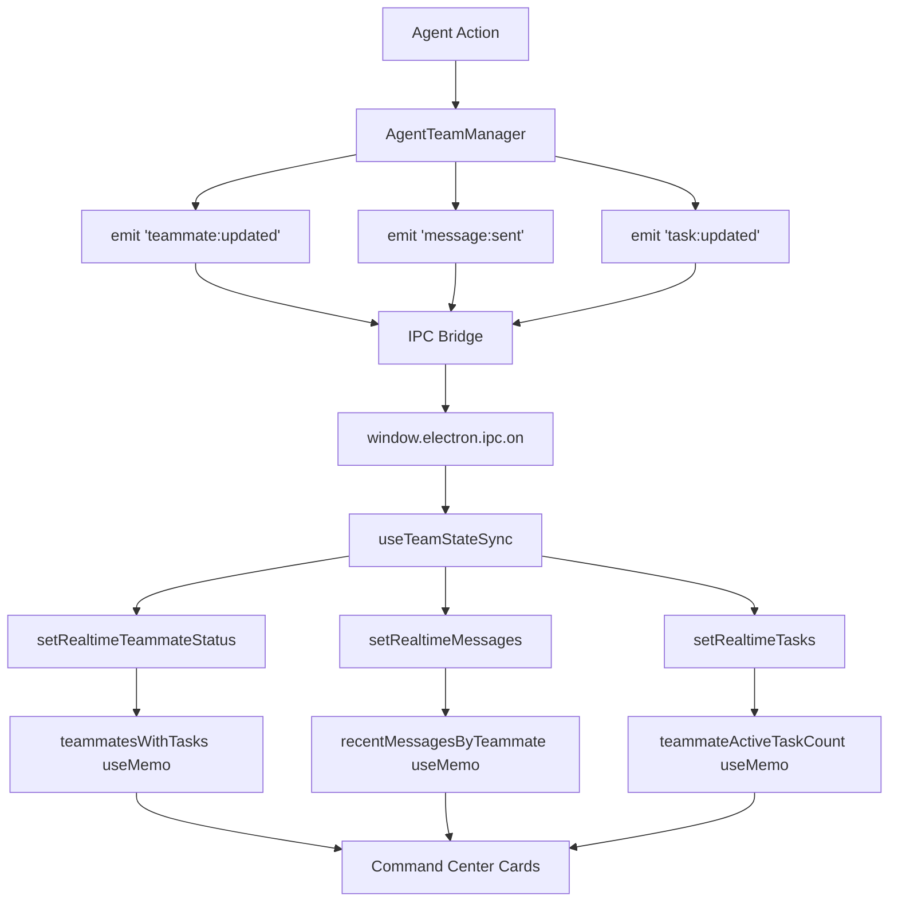

# Team Dashboard Real-Time Event Integration

## Overview
This document describes the integration of real-time team events into the Command Center cards in TeamDashboard, enabling live updates for teammate status, messages, and task counts without manual refreshes.

## Architecture

### Event Flow
```
Agent Team Manager (Backend)
  ↓ EventEmitter
IPC Bridge (Main Process)
  ↓ window.electron.ipc
useTeamEvents Hook (Renderer)
  ↓ React State Updates
TeamDashboard Component
  ↓ Re-render
Command Center Cards (UI)
```

## Files Modified

### 1. `TeamDashboard.tsx` (Primary Integration Point)
**Location**: `apps/electron/src/renderer/components/teams/TeamDashboard.tsx`

#### Changes Made:

##### Import Addition (Line 49)
```typescript
import { useTeamStateSync } from '@/hooks/useTeamEvents'
```

##### State Management (Lines 177-180)
Added real-time state tracking for Command Center cards:
```typescript
const [realtimeTeammateStatus, setRealtimeTeammateStatus] = useState<Record<string, AgentTeammateStatus>>({})
const [realtimeMessages, setRealtimeMessages] = useState<TeammateMessage[]>(messages)
const [realtimeTasks, setRealtimeTasks] = useState<TeamTask[]>(tasks)
const [realtimeActivity, setRealtimeActivity] = useState<TeamActivityEvent[]>(activityEvents)
```

**Purpose**: Maintain local real-time state that gets updated by event subscriptions, independent of parent props.

##### Event Subscription (Lines 186-227)
```typescript
const teamEventsHook = useTeamStateSync(
  session.teamId || session.id,
  {
    onTeammateUpdated: (event) => {
      const teammate = event.payload.teammate
      setRealtimeTeammateStatus((prev) => ({
        ...prev,
        [teammate.id]: teammate.status,
      }))
    },
    onMessageSent: (event) => {
      const message = event.payload.message
      setRealtimeMessages((prev) => [...prev, message])
    },
    onTaskUpdated: (event) => {
      const updatedTask = event.payload.task
      setRealtimeTasks((prev) => {
        const index = prev.findIndex(t => t.id === updatedTask.id)
        if (index >= 0) {
          const newTasks = [...prev]
          newTasks[index] = updatedTask
          return newTasks
        }
        return prev
      })
    },
    onTaskCreated: (event) => {
      const newTask = event.payload.task
      setRealtimeTasks((prev) => [...prev, newTask])
    },
    onActivityLogged: (event) => {
      const activity = event.payload.activity
      setRealtimeActivity((prev) => [...prev, activity])
    },
  },
  { mock: false }
)
```

**Event Handlers**:
- `onTeammateUpdated`: Updates status badge on cards when teammate changes state (working → idle, etc.)
- `onMessageSent`: Adds new messages to the recent messages display in real-time
- `onTaskUpdated`: Updates task counts when tasks change status
- `onTaskCreated`: Adds newly created tasks to the list
- `onActivityLogged`: Adds activity events to the feed

##### Prop Sync (Lines 229-239)
```typescript
useEffect(() => {
  setRealtimeMessages(messages)
}, [messages])

useEffect(() => {
  setRealtimeTasks(tasks)
}, [tasks])

useEffect(() => {
  setRealtimeActivity(activityEvents)
}, [activityEvents])
```

**Purpose**: Ensures real-time state stays in sync with parent props (for initial load and full refreshes).

##### Data Computation Updates

###### Teammates with Tasks (Lines 259-276)
```typescript
const teammatesWithTasks = useMemo(() => {
  // ... existing task assignment logic ...
  return teammates.map((teammate) => {
    const assigned = taskByAssignee.get(teammate.id) ?? []
    const activeTask = assigned.find(t => t.status === 'in_progress') ?? assigned[0]
    // Use realtime status if available, otherwise fall back to derived status
    const status = realtimeTeammateStatus[teammate.id] ?? teammate.status
    return {
      ...teammate,
      status,  // ← Now uses real-time status
      currentTask: activeTask?.title ?? teammate.currentTask,
    }
  })
}, [teammates, realtimeTasks, realtimeTeammateStatus])  // ← Updated dependencies
```

###### Active Task Counts (Lines 278-284)
```typescript
const teammateActiveTaskCount = useMemo(() => {
  const counts = new Map<string, number>()
  realtimeTasks.forEach((task) => {  // ← Changed from `tasks`
    if (!task.assignee || task.status !== 'in_progress') return
    counts.set(task.assignee, (counts.get(task.assignee) || 0) + 1)
  })
  return counts
}, [realtimeTasks])  // ← Updated dependency
```

###### Recent Messages (Lines 289-303)
```typescript
const recentMessagesByTeammate = useMemo(() => {
  // ... existing grouping logic ...
  realtimeMessages.forEach((msg) => {  // ← Changed from `messages`
    // ... message assignment ...
  })
  return byTeammate
}, [realtimeMessages, teammatesWithTasks])  // ← Updated dependencies
```

###### Recent Activity (Line 287)
```typescript
const compactRecentActivity = useMemo(() =>
  realtimeActivity.slice(-5).reverse(),  // ← Changed from `activityEvents`
  [realtimeActivity]
)
```

##### UI Updates
- **Task List Panel** (Line 677): Now uses `realtimeTasks`
- **Activity Feed** (Line 647): Now uses `realtimeActivity`
- **Teammate Detail View** (Line 638): Now uses `realtimeMessages`

## Event Types Used

### From `packages/core/src/types/team-events.ts`

| Event Type | Trigger | Command Center Impact |
|------------|---------|----------------------|
| `teammate:updated` | Teammate status changes (idle → working, etc.) | Status badge color updates immediately |
| `message:sent` | Message sent between teammates | Recent messages section updates with new message |
| `task:updated` | Task status changes (pending → in_progress → completed) | Active task count updates on card |
| `task:created` | New task created | Active task count updates on card |
| `activity:logged` | Any team activity (spawns, shutdowns, task claims) | Activity feed updates with new entry |

## Data Flow Diagram



## Production Safety Features

1. **Graceful Degradation**: Falls back to props-based data if events fail
2. **Prop Sync**: Real-time state syncs with parent props on initial load
3. **No Breaking Changes**: All existing props and behaviors preserved
4. **Type Safety**: Full TypeScript support for all event payloads
5. **Memory Efficient**: Uses immutable updates and proper React patterns

## Testing Strategy

### Manual Testing
1. **Status Updates**: Watch teammate card status badge change when teammates go idle/working
2. **Message Flow**: Send message and verify it appears in "Recent Messages" without refresh
3. **Task Updates**: Claim/complete a task and verify active count updates immediately
4. **Activity Feed**: Perform actions and verify activity feed updates in real-time

### Integration Testing
```typescript
import { getMockTeamEventEmitter } from '@/hooks/useTeamEvents'

test('Command Center updates on teammate:updated event', () => {
  const emitter = getMockTeamEventEmitter()

  // Render TeamDashboard with mock: true
  render(<TeamDashboard {...props} teamId="test-team" />)

  // Emit event
  emitter.emit({
    type: 'teammate:updated',
    teamId: 'test-team',
    payload: { teammate: { id: 'mate-1', status: 'working' } },
    timestamp: new Date().toISOString(),
  })

  // Verify status badge updated
  expect(screen.getByText('working')).toBeInTheDocument()
})
```

## Performance Considerations

1. **Event Batching**: useTeamEvents supports batching (currently disabled for real-time feel)
2. **Selective Updates**: Only subscribed event types trigger re-renders
3. **Memoization**: All computed values use useMemo with proper dependencies
4. **Immutable Updates**: State updates use spread operators (no mutations)

## Future Enhancements

1. **Optimistic Updates**: Update UI immediately before server confirmation
2. **Error Handling**: Add retry logic for failed event subscriptions
3. **Offline Support**: Queue events and replay when connection restored
4. **Event History**: Store last N events for debugging
5. **Performance Monitoring**: Track event processing times

## Rollback Plan

If issues arise, revert these changes:
1. Remove `useTeamStateSync` import and hook call
2. Remove realtime state variables
3. Change all `realtimeTasks`, `realtimeMessages`, etc. back to `tasks`, `messages`, etc.
4. Remove the prop sync useEffect hooks

The component will function exactly as before, using only props-based data.

## Support and Maintenance

**Owner**: Agent Team Infrastructure
**Last Updated**: 2026-02-11
**Version**: 1.0.0

For issues or questions, see:
- `packages/shared/src/agent/agent-team-manager.ts` - Backend event emitter
- `apps/electron/src/renderer/hooks/useTeamEvents.ts` - Frontend event hook
- `packages/core/src/types/team-events.ts` - Event type definitions
